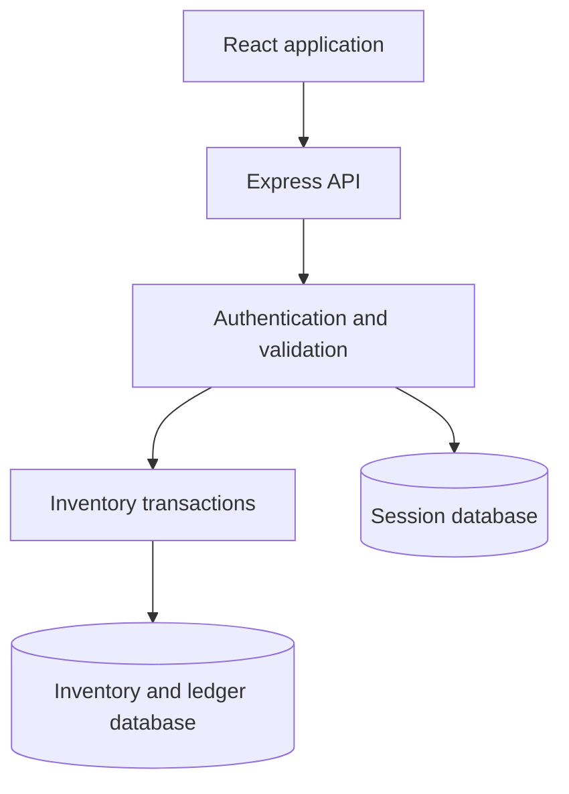

StockSense — Inventory Management System
StockSense brings products, warehouse locations and stock movements into one
workspace. Built for the Odoo hackathon, it replaces manual inventory tracking
with document-based receipts, deliveries, transfers and physical stock counts.
Each validated movement updates location balances and records its audit trail.
GitHub repository
Technology stack
Layer	Technologies
Frontend	React 18, TypeScript, Vite, Tailwind CSS, Lucide icons
Backend	Node.js, Express, TypeScript, Zod
Data	Prisma ORM, SQLite
Authentication	bcrypt password hashing, server-side sessions, SQLite session store
Email	Nodemailer with configurable SMTP
Verification	Real HTTP integration tests, React Testing Library, jsdom

Architecture
During development, Vite serves the frontend and proxies /api to Express.
In production, Express serves both the built frontend and API on a single origin.
The API validates requests and permissions, then uses Prisma transactions to
update inventory and ledger records. Sessions use a separate SQLite database.

Feature coverage
Requirement	Implementation and scope
Signup/login/logout/profile	Cookie sessions; bcrypt password hashes; signup creates staff
OTP password reset	Hashed codes, expiry, attempt cap, resend cooldown, atomic single-use reset; SMTP configuration required for email
Products/categories	Create/edit/search/filter; unique SKU; UOM; stock by location
Optional opening stock	Manager/admin only; audited operation and ledger entry
Warehouses/locations	Create/edit; multiple warehouses, location stock breakdown
Receipts	Supplier, actual received quantities, draft/validated/canceled workflow
Deliveries	Customer, picking, packing, actual shipped quantities, validation, cancellation
Transfers	Source/destination, scheduled date, paired ledger entries, conserved total
Adjustments	Physical count and reason, version-based stale-count rejection
Dashboard	Distinct stocked SKUs, out-of-stock count, reorder alerts, pending operations and scheduled transfers
Dynamic filters	Warehouse/location/category; document type and status filter operation counts/list and movement feed
Move history	Read-only API ledger with document/product/location/date filters, pagination and actor attribution
Reorder rules	Global per-product thresholds; suggested shortage amounts in product API; no automatic purchase orders

Stock figures use location/category filters. Reorder thresholds remain global per
product, so their alerts use company-wide quantities. Type/status filters do not
change the meaning of current on-hand stock. The dashboard shows up to 50 matching
documents and 10 recent movements. Receipt and transfer workflows are intentionally
simpler than delivery's Draft → Waiting → Ready → Done workflow.
Quick start — fresh local installation
Prerequisites: Git, Node.js and npm. The verification environment used Node 24.
The commands below use Windows PowerShell. Run each command after the previous
one succeeds.
git clone https://github.com/jagannathanpraneeth-blip/StockSense.git
cd StockSense
npm run install:all
Copy-Item backend/.env.example backend/.env
npm run db:upgrade
npm run seed
npm run dev
On macOS/Linux, replace Copy-Item with cp. If the repository is already cloned,
start in its root folder and skip the clone command. Do not overwrite an existing
backend/.env.
Service	Local address
Application	http://localhost:5173
API	http://localhost:5000/api
Health	http://localhost:5000/api/health

Local demo accounts
These accounts are created by npm run seed for a fresh local demo only.
The seed also creates warehouses, locations, categories and products with zero
opening stock. It is disabled in production.
Role	Email	Password
Admin	admin@stocksense.local	Admin123!
Inventory manager	manager@stocksense.local	Manager123!
Warehouse staff	staff@stocksense.local	Staff123!

Do not seed an existing working database: the seed resets the demo-account
passwords. Do not expose accounts with these known credentials in a public app.
Create a manager without demo data
Skip the seed step. After database setup, use PowerShell 7:
$env:INITIAL_ADMIN_EMAIL = "your-email@example.com"
$env:INITIAL_ADMIN_NAME = "Inventory Manager"
$env:INITIAL_ADMIN_PASSWORD = Read-Host "Choose a password (12+ characters)" -MaskInput
npm run create:manager
Remove-Item Env:INITIAL_ADMIN_PASSWORD
Passwords must be at most 72 UTF-8 bytes. On Windows PowerShell 5, put the initial
manager variables in backend/.env locally, run npm run create:manager, then
remove the password variable. Never commit credentials. This script creates an
inventory manager; it does not silently promote an existing staff account or
reset an existing manager password.
Upgrade an existing installation
Stop both servers and back up the inventory database, session database and local
environment file. From the updated repository root, run:
npm run install:all
npm run db:upgrade
npm run verify
npm run dev
The additive upgrade preserves records and supports the original two migrations
plus partial Stage 3/4 schema updates made with prisma db push. It refuses
unrecognized baselines. Do not use prisma migrate reset on existing data.
Cancel and recreate old draft adjustments after upgrading, because they lack the
new balance-version snapshot.
Stock workflows
Document	Workflow	Stock effect on validation
Receipt	Draft → Done; cancellation before completion	Adds actual received quantities at the destination
Delivery	Draft → Waiting (picking) → Ready (packed) → Done	Deducts actual picked quantities at the source
Internal transfer	Draft → Done; cancellation before completion	Deducts source and adds destination in one transaction
Adjustment	Draft with balance snapshot → Done	Applies the difference between counted and recorded stock

Draft documents do not change stock. For receipts, enter received quantities or
explicitly choose Set All to Demand. For deliveries, enter actual picked
quantities before packing. Zero quantities are not silently replaced by demand.
Completed documents cannot be edited through the application.
Signup creates warehouse staff. Staff can prepare documents and pick/pack
deliveries. Inventory managers and admins can validate stock-changing operations
and create nonzero opening balances. Profile displays the signed-in user's role.
Demonstration flow
Create a new product with zero stock and unit Units, plus locations A and B.
Step	Action	A	B	Company total
1	Receive 100 into A	100	0	100
2	Transfer 30 from A to B	70	30	100
3	Pick, pack and deliver 20 from B	70	10	80
4	Count 8 in B and validate the adjustment	70	8	78

Open the product's stock breakdown and Move History. The five ledger entries are
+100 A, -30 A, +30 B, -20 B and -2 B. Try an oversized delivery to
verify that a rejected operation leaves all stock unchanged.
Commands
Run from the repository root:
Command	Purpose
npm run install:all	Install root, backend and frontend dependencies
npm run dev	Start both development servers
npm run db:upgrade	Apply supported migrations and generate Prisma Client
npm run seed	Seed a fresh local development database
npm run create:manager	Create an initial manager from environment variables
npm run typecheck	Check both TypeScript projects
npm run build	Build backend and frontend
npm run verify	Build, then run the integration and React DOM suite
npm run test:review	Run the suite using existing builds
npm run prisma:studio	Open the Prisma database browser
npm start	Start the compiled backend, serving the built frontend

Verification
npm run verify
This starts the compiled API on a temporary port with fresh temporary inventory
and session databases, drives the real HTTP routes, and deletes only those test
files after stopping the server. It does not use your .env database.
Verified: 46 integration checks passed, including a group of 18 React DOM
interaction checks against the actual running backend. The inventory sequence
receipt → transfer → delivery → adjustment ends at A=70, B=8, total=78 with five
reconciled ledger entries. Checks also cover simultaneous validation, competing
deliveries, rollback, stale counts after out-and-back movement, quantity precision,
permissions, invalid dates, ledger pagination, packed-delivery edit protection,
OTP expiry/single-use/session invalidation, restart persistence, and routing.
The React checks cover login/Dashboard, sidebar navigation, product search and live
stock breakdown, closing the modal, both warehouse settings tabs, operation pages,
and movement-history pagination controls. They use jsdom, not a rendered browser.
The SMTP adapter delivered a reset code to an isolated local SMTP capture server;
the actual verification endpoint accepted it. Production-mode checks confirmed
Secure/HttpOnly/SameSite=Lax cookies behind the configured proxy and session access.
Both production builds passed. The earlier additive migration test retained an
existing user in a simulated partially upgraded database.
Not verified: rendered browser layout, a real recipient inbox, an external hosted
HTTPS deployment, or the supplied Docker image build (Docker was unavailable).
See START-HERE.md for your final manual checks and REVIEW_RESULTS.txt for the run.
The legacy direct-database test scripts do not substitute for this HTTP suite.
Inventory guarantees and deployment limits
- Validation writes balances, ledger entries, and completion in one transaction.
- An atomic version condition claims each operation before stock changes.
- Balance updates check the current version; insufficient stock aborts the operation.
- The API serializes mutating requests for the supported single server process
  SQLite deployment. Do not run multiple instances or clustered workers sharing
  the same database. This is not a distributed inventory service.
- Stock balance versions also detect movements that return to the same quantity.
- Completed operations cannot be edited through their application APIs.
- This is an application audit history, not a cryptographically signed ledger.
  A database administrator can still change the database directly.
- Quantities are stored as SQLite REAL, not scaled-integer database columns.
  Bounded scaled arithmetic supports up to four decimals and values up to
  100,000,000; extra input precision is rejected. Units are not converted.
- Open signup adds staff to one shared business workspace. This is not a
  multi-tenant SaaS product. Use demonstration data for a public hackathon demo.
- Dashboard data refreshes on page load, filter changes, manual refresh and every
  15 seconds while the page is visible. There is no WebSocket live push.
Single-origin hosting
Run one Node process on a host with a persistent writable volume. Both database
files must survive restarts/redeploys. Do not deploy local SQLite files to an
unpersisted serverless filesystem.
Build (install development dependencies for TypeScript/Prisma build tools):
npm ci
npm --prefix backend ci
npm --prefix frontend ci
npm run prisma:generate
npm run build
Set the environment values from backend/.env.example, with production changes:
NODE_ENV=production
PORT=<port supplied by host>
CORS_ORIGIN=https://your-public-app-host
SESSION_SECRET=<random secret of at least 32 characters>
DATABASE_URL=file:/data/inventory.db
SESSION_DB_DIR=/data
SESSION_DB_NAME=sessions.sqlite
TRUST_PROXY_HOPS=1
LOCAL_OTP_LOG=false
Set TRUST_PROXY_HOPS to match the actual reverse-proxy topology (one for a single
trusted proxy). Mount /data persistently. Run npm run db:upgrade once for the
release, create the initial manager explicitly, then npm start. The backend
serves frontend/dist and /api on the same origin. Use HTTPS for production
secure cookies. Do not run the development seed in production.
Email setup
Configure SMTP_HOST, SMTP_PORT, SMTP_USER, SMTP_PASS, and SMTP_FROM in the
host's secret environment. Port 465 uses implicit TLS; other ports use the mailer's
STARTTLS behavior. Test receipt of an actual reset email before claiming email
verification. Without SMTP the public app returns an explicit configuration error.
For local development only, setting LOCAL_OTP_LOG=true with
NODE_ENV=development prints test codes to the server terminal. Do not record
those codes or credentials in the submission video.
Docker deployment recipe
A Dockerfile and .dockerignore are included. The image builds both apps, runs as a
non-root user and starts the migration upgrade before the API. Docker was not
available in the review environment, so test the image on your host first.
docker build -t stocksense .
docker volume create stocksense-data
docker run -d --name stocksense --env-file production.env -p 5000:5000 -v stocksense-data:/data stocksense
Create a private production.env containing the production environment settings
above, your real HTTPS origin and SMTP settings. Keep it outside version control.
The proxy must terminate HTTPS and forward to port 5000. Use exactly one running
app container per database volume. For initial manager creation, run the documented
create:manager command inside that container with its environment supplied
securely by the host, then remove the initial-password variable. Never put passwords
in the Dockerfile. Back up the persistent volume with the app stopped.
Repository layout
Path	Contents
backend/prisma/	Schema, migrations and development seed
backend/src/controllers/	Authentication, catalogue and inventory endpoints
backend/src/services/	Stock arithmetic, transaction helpers and input checks
backend/src/middleware/	Sessions, permissions, errors and write serialization
backend/scripts/	Database upgrade and HTTP verification suite
frontend/src/pages/	Dashboard, inventory modules, settings and profile
frontend/src/components/	Forms, detail dialogs and shared UI
frontend/src/api/	Typed API client
frontend/scripts/	React DOM interaction tests
START-HERE.md	Local handoff and manual test checklist
REVIEW_RESULTS.txt	Recorded build and test output

Scope
StockSense is a single-business hackathon application with a single-process
SQLite deployment model. Purchasing, invoicing, barcode scanning, unit conversion,
automatic replenishment orders and multi-tenant isolation are outside its current
scope. Production hosting and external email delivery require environment-specific
configuration and verification.
